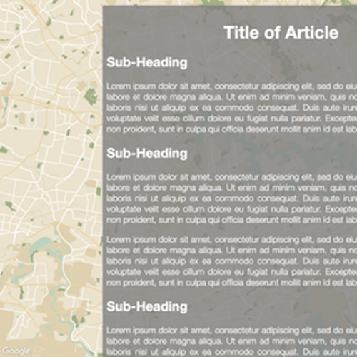

# Minimal Map Background

Helping you get random minimal maps to display as the background of your website

[View Live Demo](https://strawstack.github.io/MinimalMapBackground/index.html)

# How to Use

1. Clone this repo

2. Copy `template.html` to a new file titled `index.html`

3. Replace `YOUR_API_KEY` with your API key. Get an API key [here](https://developers.google.com/maps/documentation/javascript/get-api-key)

4. Open `index.html` with a web browser

# Adding Content to the Site

1. Add HTML code inside the `div` with class `site-content`

# Changing Site Style

1. Edit the style properties inside the `style` tag of the `index.html` document

# Change Map Style

1. Create a style using the [Google Map Styling Wizard](https://mapstyle.withgoogle.com/) 

2. Paste the resulting JSON object into the `map-styles.js` file 

3. Add the name of the JSON object to the index.html file following the current style as a template

# Screenshot

